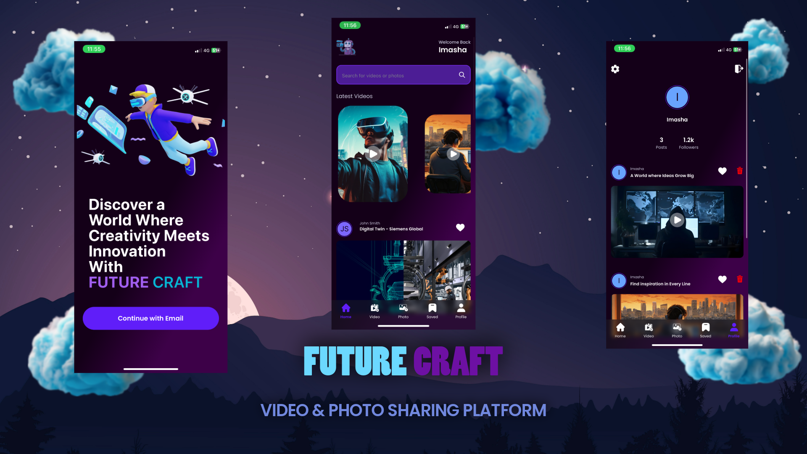

<div align="center">
  <br />
      
  <br />

  <div>
    
    
    
  </div>
  <br />
  <h1 align="center">Video and Photo Sharing Platform</h1>
  <br />
</div>

## <a name="table">Table of Contents</a>

1. [Introduction](#introduction)
2. [Tech](#tech)
3. [Features](#features)
4. [Quick Start](#quick-start)

## <a name="introduction"> Introduction</a>

Future Craft is a videos, photos sharing platform built with React Native, delivering seamless user experience, captivating animations using Animatable, and integrated with the dependable backend system of appwrite. This app showcases impressive design and functionality, enabling seamless sharing of videos and photos within the community.
I make this compatible for iphone 11 and when you view on your device it may be bit of changes of the frontend. Also,
I hide my ID's of database files so you have to make the db files on your project.

## <a name="tech"> Tech</a>

- React Native
- Expo
- Nativewind
- Animatable
- Appwrite

## <a name="features"> Features</a>

👉 **Onboarding Screen**: Engaging graphics and clear instructions welcome users to the app.

👉 **Robust Authentication & Authorization System**: Secure email login safeguards user accounts.

👉 **Dynamic Home Screen with Animated Flat List**: Smoothly animated flat list showcases the latest videos for seamless browsing.

👉 **Pull-to-Refresh Functionality**: Users can refresh content with a simple pull gesture for up-to-date information.

👉 **Full-Text Search Capability**: Efficiently search through videos and photos with real-time suggestions and instant results.

👉 **Tab Navigation**: Navigate between sections like Home, Search, and Profile with ease using tab navigation.

👉 **Two Post Creation Screen for Uploading Media**: Upload separately video and image posts directly from the app with integrated media selection.

👉 **Profile Screen with Detailed Insights**: View account details and activity, including uploaded videos, images and follower count, for a personalized experience.

👉 **Delete Post Functionality**: The user can delete their posts from the profile screen delete icon.

👉 **Edit User Details**: The user can edit their details such as username, email, password. (not done yet)

👉 **Save Post Functionality**: The user can save post that they are like through touch heart icon. The saved post can be found on save interface. (not done yet)

👉 **Responsiveness**: Smooth performance and adaptability across various devices and screen sizes for a consistent user experience.

👉 **Animations**: Dynamic animations using the Animatable library to enhance user interaction and engagement throughout the app's UI.

and many more, including code architecture and reusability

## <a name="quick-start"> Quick Start</a>

Follow these steps to set up the project locally on your machine.

**Prerequisites**

Make sure you have the following installed on your machine:

- [Git](https://git-scm.com/)
- [Node.js](https://nodejs.org/en)
- [npm](https://www.npmjs.com/) (Node Package Manager)

**Cloning the Repository**

```bash
git clone https://github.com/imashaRan12/video-photo-sharing-App-React_Native.git
cd future-craft
```

**Installation**

Install the project dependencies using npm:

```bash
npm install
```

**Running the Project**

```bash
npm start
```

**Appwrite**

Go to Appwrite and create an account.
Create a new project and Copy the Project ID (you will need it later).
Create a new Database → Add Collections (Users, Video, Photo) and copy the collection IDs.
In collection you need to create attributes in there.
In lib folder there have variables and copy the previous IDs and paste for those matching variables.
If you have no idea how to create and set up the database of appwrite watch this video<a href="https://youtu.be/YSUmzHH_OMg?si=ervP64teyI4y5aUW" target="_blank"><b> React Native Appwrite SDK - Getting started</b></a>.

**Expo Go**

Download the [Expo Go](https://expo.dev/go) app onto your device, then use it to scan the QR code from Terminal and run.

#
